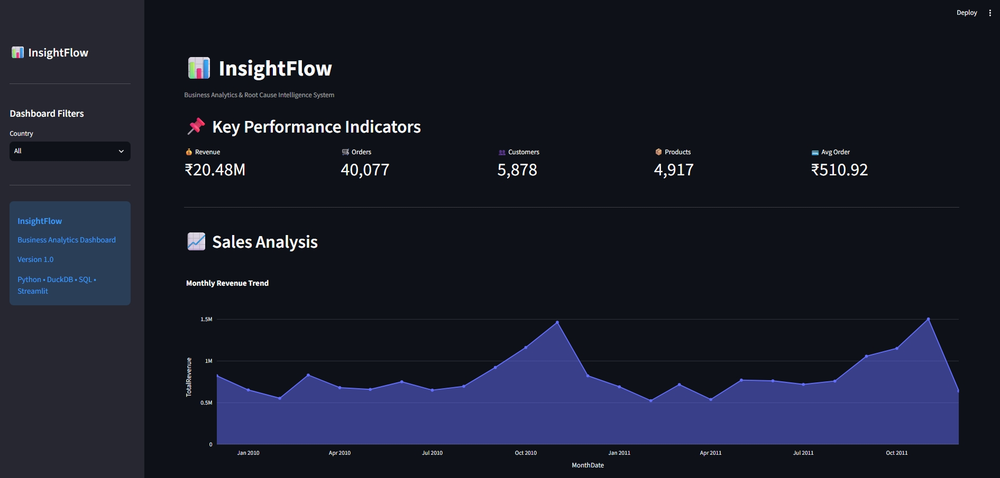
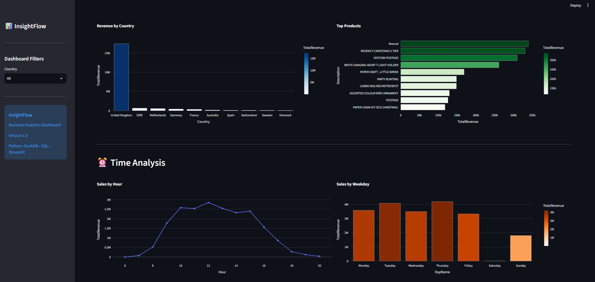
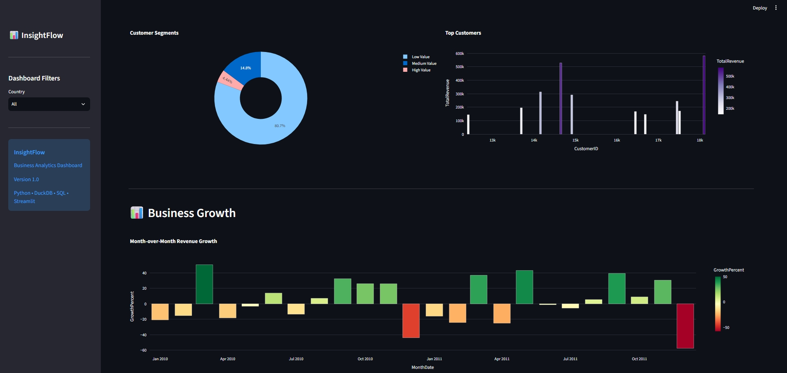
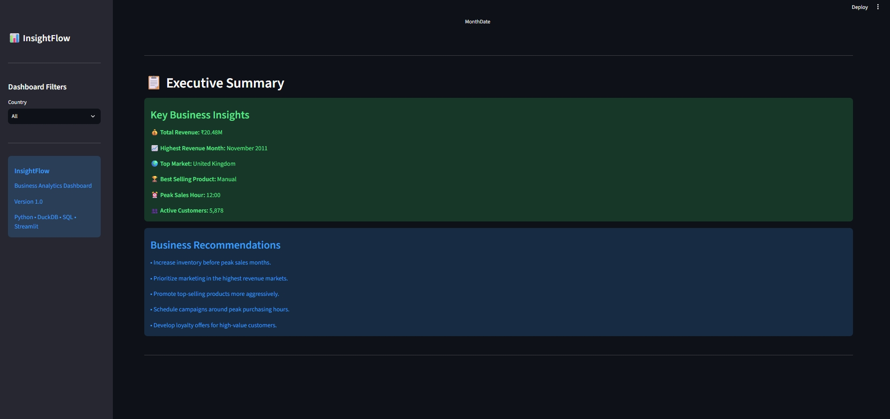

# 📊 InsightFlow – Business Analytics & Root Cause Intelligence System

InsightFlow is an interactive Business Intelligence dashboard built using **Python, DuckDB, SQL, Streamlit, and Plotly**. It transforms raw retail transaction data into meaningful business insights through KPI monitoring, trend analysis, customer segmentation, and root-cause intelligence.

The project demonstrates an end-to-end analytics workflow—from data preparation and SQL-based analysis to interactive visualization and business recommendations.

---

## 🚀 Features

- 📈 Interactive KPI Dashboard
- 🌍 Country-wise Revenue Analysis
- 📦 Top Performing Products
- ⏰ Sales Trend by Hour & Weekday
- 📅 Monthly Revenue Trend
- 📊 Month-over-Month Growth Analysis
- 👥 Customer Segmentation
- 🏆 Top Customers Analysis
- 📋 Executive Business Summary
- 🎯 Business Recommendations
- 🌐 Dynamic Country Filter
- ⚡ Fast analytical queries using DuckDB

---

<h3>Dashboard Overview</h3>







---

## 🛠 Tech Stack

| Category | Technologies |
|----------|--------------|
| Language | Python |
| Database | DuckDB |
| Query Language | SQL |
| Dashboard | Streamlit |
| Visualization | Plotly Express |
| Data Processing | Pandas |
| IDE | VS Code |

---

## 📂 Project Structure

```
InsightFlow/
│
├── app.py
├── requirements.txt
├── README.md
│
├── data/
│   └── OnlineRetail.csv
│
├── src/
│   ├── database.py
│   ├── queries.py
│   └── preprocess.py
│
└── images/
    └── dashboard.png
```

---

## 📊 Dashboard Modules

### 📌 Key Performance Indicators

- Total Revenue
- Total Orders
- Total Customers
- Total Products
- Average Order Value

---

### 📈 Sales Analysis

- Monthly Revenue Trend
- Revenue Growth
- Month-over-Month Growth

---

### 🌍 Geographic Analysis

- Revenue by Country

---

### 📦 Product Analysis

- Top Selling Products

---

### ⏰ Time Analysis

- Sales by Hour
- Sales by Weekday

---

### 👥 Customer Analysis

- Customer Segmentation
- Top Customers

---

### 📋 Executive Summary

Automatically summarizes:

- Highest revenue month
- Top-performing country
- Best-selling product
- Peak sales hour
- Overall business performance

---

## 📈 Business Insights Generated

InsightFlow helps answer questions like:

- Which country contributes the most revenue?
- Which products generate maximum sales?
- Which customers drive the business?
- What are the peak shopping hours?
- How is revenue growing month-over-month?
- Which customer segment contributes the highest value?

---

## 📁 Dataset

The project uses the **Online Retail Dataset**, containing transactional records of a UK-based online retailer.

Dataset includes:

- Invoice Number
- Product Description
- Quantity
- Unit Price
- Revenue
- Invoice Date
- Customer ID
- Country

---

## ⚙️ Installation

Clone the repository

```bash
git clone https://github.com/yourusername/InsightFlow.git
```

Move into the project directory

```bash
cd InsightFlow
```

Install dependencies

```bash
pip install -r requirements.txt
```

Run the application

```bash
streamlit run app.py
```

---

## 📊 SQL Analytics Implemented

The project includes SQL-based analytical functions such as:

- KPI Aggregation
- Monthly Revenue Analysis
- Country Performance
- Customer Segmentation
- Top Products
- Top Customers
- Sales by Hour
- Sales by Weekday
- Month-over-Month Growth
- Revenue Contribution Analysis

---

## 🎯 Business Value

InsightFlow enables organizations to:

- Monitor business performance
- Identify high-value customers
- Discover top-performing markets
- Detect revenue trends
- Support data-driven decision making
- Generate actionable business insights

---

## 🔮 Future Enhancements

- AI-generated business insights using Large Language Models
- Predictive sales forecasting
- Customer Lifetime Value (CLV) analysis
- Product recommendation engine
- Profitability analysis
- Automated anomaly detection
- Export reports as PDF

---

## 👨‍💻 Author

**Manohar Vinay Mududundi**

Integrated Dual Degree (B.Tech + M.Tech) in Electronics & Communication Engineering

Jawaharlal Nehru Technological University Hyderabad

---

## 📄 License

This project is licensed under the MIT License.
